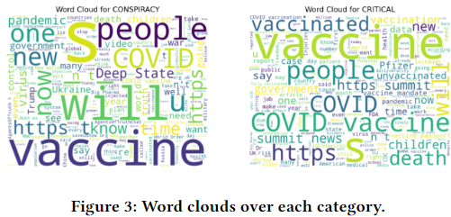

<h2 align="center">
  <a href="https://moseskonto.tu-berlin.de/moses/modultransfersystem/bolognamodule/beschreibung/anzeigen.html?nummer=41047&version=1&sprache=2">SoSe2024: Natural Language Processing</a><br/>
  TU Berlin, Computer Engineering MSc.
</h2>
<div align="center">
  
</div>

### Content
[🏫 Online Learning Platform](https://ki-campus.org/node/487) <br>
Contents: Pre-processing, Vector Representation, Word Embedding, Text Corpus, Language Models, Semantic Textual Similarity, Spam Filtering, Keyphrase Extraction...

### Lab & Homework ✍️
1. Analyzing public opinion bias on pandemic through oppositional thinking analysis.
2. English-Italian Machine Translation Using Seq2Seq Model.

<div align="center">
  
</div>

How to export the environment?
```conda env export > environment.yml```
