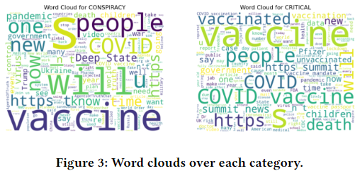

[🇨🇳 中文文档 | Chinese README](./README.zh-CN.md)

# Natural Language Processing Projects

<div align="center">
  
</div>

## 📚 Content
[🏫 Online Learning Platform](https://ki-campus.org/node/487)  
Topics: Pre-processing, Vector Representation, Word Embedding, Text Corpus, Language Models, Semantic Textual Similarity, Spam Filtering, Keyphrase Extraction...

## 🧪 Lab & Homework

### 1. Pandemic Public Opinion Analysis
- **Goal:** Analyze social media text during the pandemic for sentiment and stance using oppositional thinking analysis.
- **Techniques:** Text preprocessing, feature extraction, sentiment/stance classification, and visualization.
- **Details:** Combines NLP with social science methods to reveal public opinion trends and polarization.
- [Report (PDF)](NLP_project1_4/NLP_project1_4_report.pdf)

### 2. English-Italian Machine Translation (Seq2Seq)
- **Goal:** Build a neural machine translation model (English↔Italian) using deep learning (Seq2Seq with attention).
- **Dataset:** Europarl v7 English-Italian parallel corpus (~1.9M sentence pairs).
- **Techniques:** Data cleaning, tokenization, sequence modeling, encoder-decoder with attention, evaluation.
- **Training Results:**
  - Training accuracy: up to **0.8508**
  - Training loss: down to **0.9742**
  - Validation accuracy: up to **0.8528**
  - Validation loss: down to **0.9664**
- **Notebook:** [Code & Experiments](NLP_project2_2/nlp_2_code.ipynb)

<div align="center">
  
</div>

---

## 🛠️ Environment
To export the environment:
```conda env export > environment.yml```
